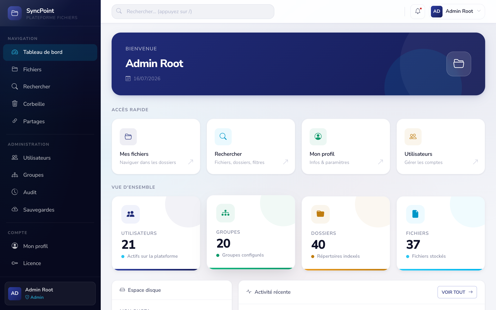
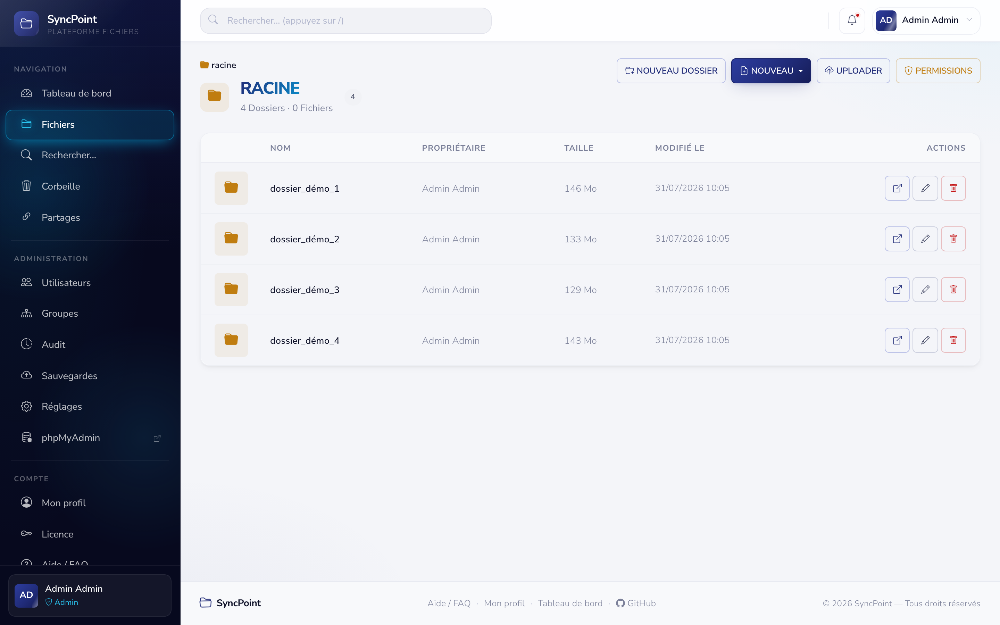
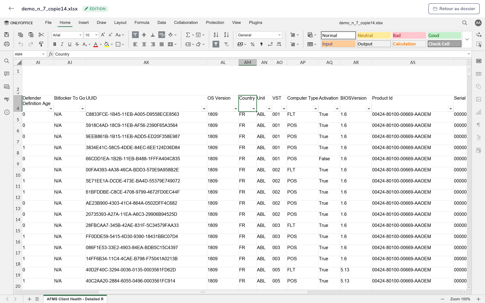

# 📂 SyncPoint — Landing Page

> Vos fichiers, partout avec vous. Une alternative moderne à SharePoint.

Plateforme de gestion de fichiers et de collaboration : stockez, organisez, partagez et sécurisez vos documents d'entreprise depuis un seul endroit. Permissions inspirées de NTFS, édition OnlyOffice, recherche rapide, notifications in-app. Hébergé par nos soins ou on-premise pour les grands comptes.

⚡ **Stack** : HTML · CSS · JS vanilla — aucune dépendance, un seul fichier `index.html`
🎯 **Mission** : présenter l'app SyncPoint au reste du monde
🌐 **Voir la landing page** : https://lud972vic.github.io/SyncPoint/
🚀 **Statut** : _Bientôt en production — nous finalisons les derniers réglages…_

📸 **Captures** : parce que les mots, c'est bien, mais les images, c'est mieux :





## Fonctionnalités présentées

- 🔐 Authentification sécurisée
- 📁 Explorateur de fichiers avec permissions NTFS (héritage, refus explicite)
- 👥 Groupes & espaces collaboratifs
- 🔍 Recherche avancée multicritères
- 📝 Édition OnlyOffice (Word, Excel, PPT, CSV)
- 📄 Aperçu PDF & images
- 🔗 Liens de partage avec expiration et mot de passe
- 🗑️ Corbeille & restauration
- ⭐ Favoris & bookmarks
- 🔔 Notifications in-app
- 📊 Journal d'audit complet (export CSV)
- 🛠️ Administration & sauvegardes
- 🔑 API REST + JWT (Swagger)
- 🌐 Bilingue Français / Anglais

## Tarifs

| Plan | Prix | Usage |
|------|------|-------|
| **Starter** | 20 €/mois | Hébergé, quotas limités |
| **Pro** | 200 €/mois | Hébergé, quotas illimités |
| **Enterprise** | 8 000 €/projet | On-premise, souveraineté totale |

Aucune licence par utilisateur. Jamais.

## Structure du dépôt

```
.
├── index.html      # Landing page complète (HTML + CSS + JS)
└── captures/       # Captures d'écran réelles de l'application
    ├── 01-login.png
    ├── 02-dashboard.png
    ├── 03-browse.png
    └── ... (20 captures au total)
```

## Déploiement (GitHub Pages)

1. Le dépôt est servi via **GitHub Pages** sur la branche `main`
2. URL : https://lud972vic.github.io/SyncPoint/
3. Les images sont chargées depuis `/SyncPoint/captures/`

## Liens

- 🌐 **Landing page** : https://lud972vic.github.io/SyncPoint/
- 📦 **Application SyncPoint** : _bientôt disponible_
- 📧 **Contact** : via le formulaire de la landing page

---

<p align="center">Fait avec ☕ — SyncPoint SAS</p>
